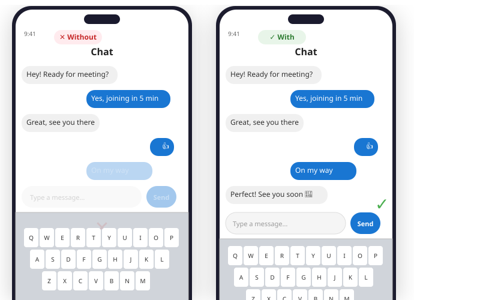

# cmp-keyboard



```kotlin
// build.gradle.kts (module)
dependencies {
    implementation("io.github.govindtank:cmp-keyboard:1.0.0")
}
```

**Compose Multiplatform reactive keyboard-aware layout.**

A lightweight library that detects the software keyboard on Android and iOS and provides a simple composable API to adjust your layout.

## Why?

Compose Multiplatform has no built-in way to handle the software keyboard across platforms:

- **Android** — `Modifier.imePadding()` exists but is inconsistent on foldables, landscape, and gesture nav
- **iOS** — The keyboard overlays your Compose content entirely. No built-in handling.

`cmp-keyboard` solves this with **one composable** that works everywhere.

## Installation

```kotlin
// settings.gradle.kts
dependencyResolutionManagement {
    repositories {
        mavenCentral()
    }
}

// build.gradle.kts (module)
dependencies {
    implementation("io.github.govindtank:cmp-keyboard:1.0.0")
}
```

## Quick Start

```kotlin
import io.github.govindtank.keyboard.KeyboardAware
import io.github.govindtank.keyboard.rememberKeyboardInfo

@Composable
fun ChatScreen() {
    val keyboard by rememberKeyboardInfo()

    KeyboardAware {
        Column {
            LazyColumn { /* messages */ }
            TextField(value = text, onValueChange = { text = it })
            Button(onClick = { }) { Text("Send") }
        }
    }

    // Status banner
    if (keyboard.isVisible) {
        Text("Keyboard: ${keyboard.height}")
    }
}
```

## Usage

### Option 1: `KeyboardAware` wrapper — moves content above keyboard

```kotlin
import io.github.govindtank.keyboard.KeyboardAware

KeyboardAware {
    // Your content automatically stays above the keyboard
    Column {
        TextField(...)
        Button(...) { }
    }
}
```

### Option 2: `KeyboardAwareColumn` — Column variant with `ColumnScope`

```kotlin
import io.github.govindtank.keyboard.KeyboardAwareColumn

KeyboardAwareColumn {
    // ColumnScope available here
    item { Text("Hello") }
    item { TextField(...) }
}
```

### Option 3: Manual control via `rememberKeyboardInfo()` state

```kotlin
import io.github.govindtank.keyboard.rememberKeyboardInfo

@Composable
fun MyScreen() {
    val keyboard by rememberKeyboardInfo()

    Box(
        modifier = Modifier.padding(
            bottom = if (keyboard.isVisible) keyboard.height else 0.dp
        )
    ) {
        // Your content
    }
}
```

### Option 4: `Modifier.keyboardPadding()` — attach to any scrollable

```kotlin
import io.github.govindtank.keyboard.rememberKeyboardInfo
import io.github.govindtank.keyboard.keyboardPadding

@Composable
fun MessageList() {
    val keyboard by rememberKeyboardInfo()

    LazyColumn(
        modifier = Modifier.keyboardPadding(keyboard)
    ) {
        items(messages) { MessageItem(it) }
    }
}
```

## API Reference

| Type | Kind | Description |
|------|------|-------------|
| `KeyboardAware` | `@Composable fun` | Wrapper that pushes content up when keyboard appears. Receives `KeyboardInfo` in content lambda. |
| `KeyboardAwareColumn` | `@Composable fun` | Column variant providing `ColumnScope` inside content lambda. |
| `rememberKeyboardInfo()` | `@Composable expect fun` | Returns `State<KeyboardInfo>` observing keyboard visibility, height, animation duration. |
| `KeyboardInfo` | `data class` | Holds `isVisible: Boolean`, `height: Dp`, `animationDurationMs: Long`. |
| `KeyboardInfo.Hidden` | `companion val` | Empty state — `KeyboardInfo(false, 0.dp, 0L)`. |
| `Modifier.keyboardPadding()` | `fun Modifier` | Adds bottom padding equal to keyboard height when visible. Use on `LazyColumn`, `Column`, `Box`, etc. |

### `KeyboardInfo` Properties

| Property | Type | Description |
|----------|------|-------------|
| `isVisible` | `Boolean` | Whether the keyboard is currently shown |
| `height` | `Dp` | Keyboard height in Density-independent pixels |
| `animationDurationMs` | `Long` | Show/hide animation duration in milliseconds |

## Platform Support

| Platform | Detection Method | Notes |
|----------|------------------|-------|
| **Android** | `ViewTreeObserver.OnGlobalLayoutListener` + visible display frame | Works on foldables, landscape, gesture nav. Falls back to `imePadding` when available. |
| **iOS** | `UIResponder.keyboardWillShowNotification` / `keyboardWillHideNotification` | Uses safe-area insets (iOS 15+). Handles split keyboard, floating keyboard, external keyboards. |

## Sample

Check the `sample/` directory for a complete working app with form and chat demos.

## License

Apache 2.0